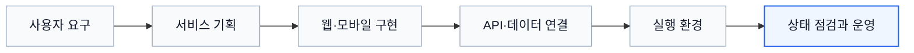
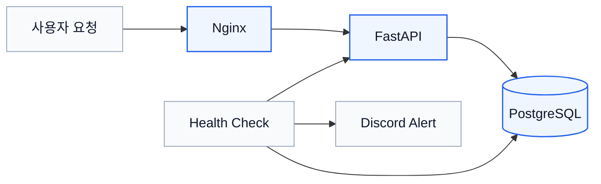

 

### 서비스의 흐름을 이해하고 문제를 실행 가능한 구조로 정리합니다.

 

 
 

 

## 소개

> **사용자와 기술 사이의 흐름을 이해하고,  
> 문제가 발생했을 때 원인과 다음 행동을 정리합니다.**

서비스 기획과 개발 프로젝트를 수행하며  
사용자의 요청이 화면, 서버, 데이터로 이어지는 흐름을 경험했습니다.

팀장과 PM으로 일정·역할·산출물을 관리하고,  
화면 명세와 API 명세를 정리해 협업 기준을 만들었습니다.

카카오 지도 운영 업무에서는 월 250건 이상의 장소 데이터를 검토하며  
반복 오류를 11개 유형으로 분류하고 처리 기준을 정리했습니다.

최근에는 Docker 기반 프로젝트를 통해  
서비스 실행 환경, 로그 확인, Health Check, 장애 알림을 구성해 흐름을 설계했습니다.

이 과정에서 AX의 기반이 되는 흐름 속 요소에 대한 이해를 높였습니다.

 

---
## 핵심 역량

<table>
  <tr>
    <td align="center" width="25%">
      <strong>01</strong> 
      <strong>문제 구조화</strong> 
      의견과 데이터를 실행 과제로 정리
    </td>
    <td align="center" width="25%">
      <strong>02</strong> 
      <strong>프로젝트 운영</strong> 
      일정·역할·산출물 진행 흐름 관리
    </td>
    <td align="center" width="25%">
      <strong>03</strong> 
      <strong>서비스 구현</strong> 
      웹·모바일 UI와 API 연결
    </td>
    <td align="center" width="25%">
      <strong>04</strong> 
      <strong>운영 관점</strong> 
      로그와 상태 정보를 통한 문제 구간 확인
    </td>
  </tr>
</table>

 

---

## 주요 프로젝트

<table>
  <tr>
    <td width="34%" valign="top">

### [`ops-monitor`](https://github.com/yooneverse/ops-monitor)

**서비스 운영·장애 대응 흐름 설계 AX 인프라 프로젝트**

`Docker` `Nginx` `FastAPI` `PostgreSQL`

- 실행 환경 구성
- Health Check
- 로그 분석
- 장애 알림
- 운영 문서화

  </td>
    <td width="33%" valign="top">

### [`project-eumgil`](https://github.com/yooneverse/project-eumgil)

**보행 약자를 위한 배리어프리 길찾기 서비스**

`Kotlin` `Android` `Accessibility`

- 팀장 및 PM
- 모바일 UI/UX 설계
- 접근성 화면
- API 연동
- 최종 발표

  </td>
    <td width="33%" valign="top">

### [`project-aekkim`](https://github.com/yooneverse/project-aekkim)

**구독 현황 분석과 해지 관리를 지원하는 서비스**

`React` `TypeScript` `AI`

- 웹 UI
- API 연동
- AI 기능 연결
- 서비스 기획
- 발표

  </td>
  </tr>
</table>

 

| 프로젝트                                                               | 설명                           | 주요 역할                         |
| ------------------------------------------------------------------ | ---------------------------- | ----------------------------- |
| [`project-arnnect`](https://github.com/yooneverse/project-arnnect) | 신진 예술인의 작품과 전시 경험을 연결한 웹 서비스 | UX 흐름 · 웹 UI · 비주얼 구성 · 발표    |
| [`project_ILU`](https://github.com/yooneverse/project_ILU)         | 사용자 성향과 기업 데이터를 연결한 추천 서비스   | 데이터 분석 · 추천 흐름 · 서비스 기획       |
| [`maeulbot`](https://github.com/yooneverse/maeulbot)               | 일정과 공지 전달을 위한 알림 자동화 프로젝트    | GitHub Actions · 업무 자동화 · 문서화 |

---

## 대표 프로젝트

AX · Infra · Ops · Documentation

### [`ops-monitor`](https://github.com/yooneverse/ops-monitor)

**서비스 운영·장애 대응을 위한 AX 기반 인프라 프로젝트**

 

 

AI와 자동화 기능이 실제 서비스로 이어지기 위해서는 기능 구현뿐 아니라 실행 환경, 상태 점검, 장애 대응 흐름이 함께 필요하다는 점을 알게 되었습니다. 
이에 기술이 서비스 운영까지 연결되는 AX 흐름을 이해하기 위해, 이를 뒷받침하는 인프라 환경을 직접 구성했습니다.

Docker Compose 기반으로 FastAPI, PostgreSQL, Nginx를 연결하고  
서비스 상태 점검, 로그 확인, 장애 알림 흐름을 구성했습니다.

- API 및 DB Health Check
- Nginx 리버스 프록시 구성
- Discord 장애 알림
- 장애 상황 재현 및 로그 확인
- 트러블슈팅과 운영 과정 문서화
  

> 상세 구조와 장애 대응 기록은 프로젝트 저장소에서 확인할 수 있습니다.

---

## 경험

<table>
  <tr>
    <td width="50%" valign="top">

### 카카오 장소 데이터 운영

* 15개월간 월 250건 이상의 장소 데이터 검토
* 폐업, 이전, 중복 등록, 카테고리 오류 확인
* 반복 오류를 11개 유형으로 분류
* 데이터 검토 기준과 처리 흐름 정리

  </td>
    <td width="50%" valign="top">

### 삼성 청년 SW·AI 아카데미

* 웹·모바일·AI 프로젝트 수행
* 팀장과 PM으로 일정·역할·산출물 관리
* 프론트엔드 개발 및 운영 참여
* **우수상** 선정 프로젝트 기획
* 최종 발표와 발표 자료 제작

  </td>
  </tr>
  <tr>
    <td width="50%" valign="top">

### [더 똑똑한 공원 길 찾기](https://seoulforest.letsee.io/)

* 제안자 겸 PL로서 시민 220여 명의 의견 수집 및 분류
* 서비스 기능과 안내 정보의 우선순위 설계
* **서울시 엠보팅 우수 제안 선정 (70% 이상 득표)**
* **6억 5천만 원 규모 사업 예산 확보**
* **서울시 시민참여예산제 우수 제안 선정**
* **서울특별시장상 창의상 수상**

  </td>
    <td width="50%" valign="top">

### 문화체육관광부 대학생 기자단

* 23명의 기사 주제와 취재 일정 관리
* 제출 현황 및 확인 사항 정리
* 일정 변경 공지와 진행 상황 공유
* 구성원별 후속 업무 조율
* **19기 선발 면접관 참여**

  </td>
  </tr>

</table>

---

## 기술 스택

### 인프라·운영

  
  
  
  

Docker Compose로 다중 컨테이너 환경을 구성하고, Nginx 요청 전달과 로그 기반 장애 확인을 경험했습니다.

### 백엔드·데이터베이스

  
  
  
  
  

API 요청·응답과 데이터 저장 흐름을 구현하고, 애플리케이션과 DB 연결 상태를 점검했습니다.

### 웹·모바일

  
  
  
  
  

웹·모바일 UI를 구현하고 API 응답, 로딩, 오류 상태가 사용자 흐름과 연결되도록 구성했습니다.

### 협업·문서화

  
  
  
  
  

일정과 역할, 화면 명세, API 명세를 공유해 팀이 같은 기준으로 작업할 수 있도록 관리했습니다.

 

 
 

<h3>김지윤</h3>

<strong>서비스 흐름 설계 · 프로젝트 운영 · 인프라</strong>

